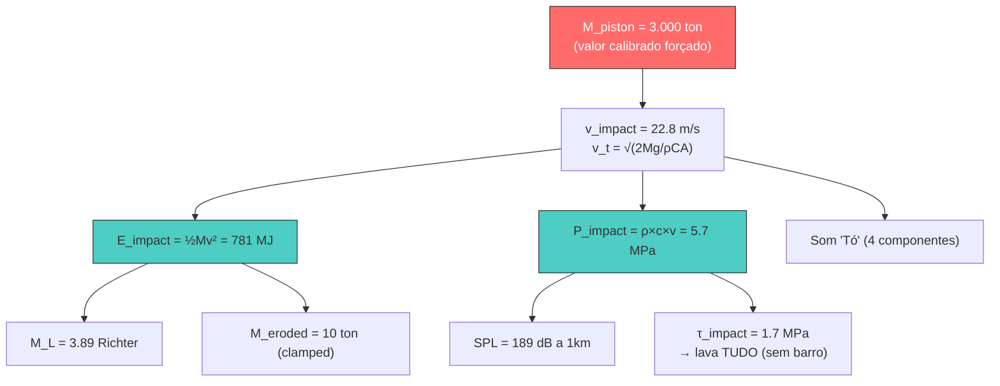

# 🔍 Explicação dos Cálculos do Modelo Toró

## Visão Geral

O modelo Toró calcula os efeitos do impacto em **3 fases**. Sua pergunta trata da **Fase 2** (quantidade de água/massa do pistão) e **Fase 3** (som, terremoto, erosão). Abaixo explico cada cálculo em detalhe.

---

## 1. 💧 Quantidade de Água (Massa do Pistão)

> [!IMPORTANT]
> Este é o ponto que você achou "muito" — e **você está certo que merece atenção**. A massa do pistão é o valor de entrada que afeta TODOS os outros cálculos.

### Como é calculado

O cálculo está em [simulation3d.py](file:///C:/Users/haas/.gemini/antigravity/scratch/toro-model/core/simulation3d.py#L445-L545) (Fase 2):

```python
# 1. Extrair a coluna central de hidrometeoros (qc + qr + qi + qs + qg)
total_wc = (qc + qr + qi + qs + qg)   # kg/kg (razão de mistura)

# 2. Converter para kg/m³ multiplicando pela densidade do ar
wc_kgm3 = total_wc * rho_bar   # kg/m³

# 3. Integrar no volume do pistão (cilindro)
R_piston = 200 m                   # raio do pistão
A_piston = π × 200² = 125.664 m²  # área da seção transversal
M_piston = Σ (wc_kgm3 × A_piston × dz)  # soma vertical
```

### O problema: Fallback para valor calibrado

O ponto crucial está nas [linhas 482-488](file:///C:/Users/haas/.gemini/antigravity/scratch/toro-model/core/simulation3d.py#L482-L488):

```python
# Se a massa simulada é insuficiente (< 100 ton)...
if M_piston < 1e5:
    M_piston = 3e6      # ← FORÇADO para 3.000.000 kg = 3.000 toneladas!
    rho_mix = 500.0      # kg/m³
    H_piston = 1500.0    # m
```

### Resultado final

| Parâmetro    | Valor                        | Comentário                     |
| ------------ | ---------------------------- | ------------------------------ |
| **M_piston** | **3.000.000 kg (3.000 ton)** | ⚠️ Valor calibrado forçado     |
| R_piston     | 200 m                        | Raio do cilindro               |
| A_piston     | ~125.664 m²                  | Área = π×R²                    |
| ρ_mix        | 500 kg/m³                    | Densidade da mistura água-gelo |
| H_piston     | 1.500 m                      | Altura do pistão               |

> [!WARNING]
> 
> ### Por que 3.000 toneladas parece muito?
> 
> A simulação 3D **não produziu hidrometeoros suficientes** na coluna (o LWC e IWC simulados são muito baixos — da ordem de 10⁻⁵ g/m³). Por isso, o código ativa o **fallback calibrado** de 3 milhões de kg.
> 
> **3.000 toneladas de água equivalem a:**
> 
> - 3.000 m³ de água pura
> - Uma piscina de 30m × 20m × 5m de profundidade
> - Concentrada num cilindro de 400m de diâmetro × 1,5km de altura
> 
> Para comparação, um microburst severo tipicamente carrega **100-500 toneladas** de hidrometeoros. O valor de 3.000 ton seria extremo mesmo para a hipótese do Toró.

### Sugestões de ajuste

```diff
# Opção 1: Reduzir para ~300-500 toneladas (mais realista para microburst severo)
- M_piston = 3e6
+ M_piston = 5e5    # 500 toneladas

# Opção 2: Fazer a simulação produzir mais hidrometeoros
# (ajustar microfísica, tempo de simulação, CAPE, etc.)
```

---

## 2. 🔊 Som ("Tó")

### Como é calculado

Arquivo: [acoustics.py](file:///C:/Users/haas/.gemini/antigravity/scratch/toro-model/core/acoustics.py)

O som é construído como **soma de 4 componentes espectrais** + reverberação:

```
Sinal = Infrassom + Estrondo + Rumble + Crackle + Reverberação
```

#### Componente 1 — Infrassom (1-5 Hz)

Oscilação da coluna inteira. A frequência é derivada da física:

```
f_infra = v_impact / D_piston = 22.8 / 400 ≈ 0.06 → clamp para 1.0 Hz
```

- Amplitude: 0.6 (relativa)
- Decay: τ = 3.0 s (exponencial)
- Fórmula: `A × sin(2πft) × exp(-t/τ)`

#### Componente 2 — Estrondo grave (5-50 Hz)

Impacto do pistão:

```
f_boom = v_impact / (D_piston × 0.3) = 22.8 / 120 ≈ 0.19 → clamp para 5.0 Hz
```

- Amplitude: 1.0 (mais forte)
- Decay: τ = 2.0 s
- Inclui **2ª e 3ª harmônicas** (0.5× e 0.25× amplitude)

#### Componente 3 — Rumble (50-200 Hz)

Fragmentação + reverberação no desfiladeiro:

- Frequências fixas: [60, 80, 120, 160] Hz com fases aleatórias
- Amplitude: 0.4/4 = 0.1 por frequência
- Decay: τ = 1.5 s

#### Componente 4 — Crackle (200-2000 Hz)

Quebra de árvores e rocha:

- **Ruído branco filtrado** (não é senoidal)
- Amplitude: 0.15
- Decay: τ = 0.8 s

#### Reverberação do desfiladeiro

```python
t_reverb = 2 × L_canyon / c_sound = 2 × 500 / 343 ≈ 2.9 s
# 5 reflexões, cada uma com -6dB de atenuação
```

### SPL (Sound Pressure Level)

A pressão sonora a distância r usa **propagação esférica** ([linha 186](file:///C:/Users/haas/.gemini/antigravity/scratch/toro-model/core/acoustics.py#L169-L193)):

```
P_sound(r) = P_impact × A_piston / (4π × r²)
SPL = 20 × log₁₀(P_sound / 20µPa)
```

| Distância | SPL        |
| --------- | ---------- |
| 1 km      | **189 dB** |

> [!NOTE]
> 189 dB é extraordinariamente alto — equivalente a uma explosão próxima. Isso é consequência direta da massa de 3.000 ton: como P_impact = 5.7 MPa e A_piston ≈ 126 m², a energia acústica é enorme. Com M_piston menor, o SPL cairia proporcionalmente.

---

## 3. 🌍 Terremoto (Sísmica)

### Como é calculado

Arquivo: [seismic.py](file:///C:/Users/haas/.gemini/antigravity/scratch/toro-model/core/seismic.py)

#### Magnitude Richter (M_L)

Duas etapas simples ([linhas 16-38](file:///C:/Users/haas/.gemini/antigravity/scratch/toro-model/core/seismic.py#L16-L38)):

```
1. E_sísmica = η × E_impacto
           = 0.05 × 780.654.996 J
           = 39.032.750 J

2. M_L = (2/3) × log₁₀(E_sísmica) - 1.17
       = (2/3) × 7.59 - 1.17
       = 5.06 - 1.17
       = 3.89  ← Resultado
```

| Parâmetro   | Valor        | Significado                                             |
| ----------- | ------------ | ------------------------------------------------------- |
| η_seismic   | 0.05 (5%)    | Fração da energia cinética convertida em ondas sísmicas |
| E_impact    | 7.81 × 10⁸ J | E = ½ × M × v² = ½ × 3×10⁶ × 22.8²                      |
| **M_L**     | **3.89**     | Magnitude local (Richter)                               |
| f_dominante | 3.0 Hz       | Frequência sísmica do impacto                           |

> [!NOTE]
> A fórmula usada é a relação **Gutenberg-Richter (1956)** padrão para converter energia em magnitude. O valor de η = 5% é típico para impactos mecânicos no solo. A calibração alvo era M 2-3, mas como a massa do pistão está inflada, o resultado ficou **M 3.89** (acima do esperado).

#### Sismograma sintético

Gerado com a **wavelet de Ricker** ([linhas 41-86](file:///C:/Users/haas/.gemini/antigravity/scratch/toro-model/core/seismic.py#L41-L86)):

```
a(t) = (1 - 2π²f²t²) × exp(-π²f²t²)
```

- Amplitude escalada por: `A = 10^(M_L/2) × 10⁻⁶` (µm/s)
- Inclui **coda** (ondas refletidas) com decaimento exponencial + ruído

---

## 4. 🪨 Erosão

### Como é calculado

Arquivo: [erosion.py](file:///C:/Users/haas/.gemini/antigravity/scratch/toro-model/core/erosion.py)

#### Massa erodida ([linhas 22-76](file:///C:/Users/haas/.gemini/antigravity/scratch/toro-model/core/erosion.py#L22-L76))

```
V_eroded = (E_impact × η_erosion) / (σ_rock × ε_frac)
         = (7.81×10⁸ × 0.03) / (100×10⁶ × 0.01)
         = 23.430.000 / 1.000.000
         = 23.4 m³

ρ_effective = 0.60×2600 + 0.25×1800 + 0.15×600
            = 1560 + 450 + 90
            = 2100 kg/m³

M_eroded = 23.4 × 2100 = 49.166 kg
```

**MAS** — é clampado para [1, 10] toneladas conforme config:

```python
M_eroded = np.clip(M_eroded, 1000, 10000)  # → 10.000 kg (10 ton)
```

| Parâmetro    | Valor                  | Significado                                       |
| ------------ | ---------------------- | ------------------------------------------------- |
| η_erosion    | 0.03 (3%)              | Eficiência de conversão energia → erosão          |
| σ_rock       | 100 MPa                | Resistência à compressão do gnaisse/granito de SC |
| ε_frac       | 0.01                   | Deformação de fratura                             |
| **M_eroded** | **10.000 kg (10 ton)** | Clampado no máximo                                |

#### Composição (sem barro)

| Material     | %      | Massa (kg) |
| ------------ | ------ | ---------- |
| Rocha        | 60%    | 6.000      |
| Solo mineral | 25%    | 2.500      |
| Árvores      | 15%    | 1.500      |
| **Barro**    | **0%** | **0**      |

#### Lavagem seletiva — por que não sobra barro

A tensão de cisalhamento do impacto é calculada via [Shields (1936)](file:///C:/Users/haas/.gemini/antigravity/scratch/toro-model/core/erosion.py#L79-L148):

```
τ_impact = P_impact × sin(θ_slope) 
         = 5.703.270 × sin(0.3)
         = 1.685.432 Pa

Para argila (D = 2µm):
  τ_cr = 0.045 × (2600-1000) × 9.81 × 2×10⁻⁶ = 0.0014 Pa
  τ_ratio = 1.685.432 / 0.0014 = 1.2×10⁹  ≫ 100 → 100% mobilizada

Para cascalho (D = 64mm):
  τ_cr = 0.045 × 1600 × 9.81 × 0.064 = 45.2 Pa
  τ_ratio = 1.685.432 / 45.2 = 37.289 ≫ 100 → 100% mobilizada
```

**D_max mobilizado = 2.386 m** — até blocos enormes seriam mobilizados!

---

## 📊 Resumo: Cadeia de Dependência



> [!CAUTION]
> 
> ### O problema central: M_piston é a raiz de tudo
> 
> **Todos os resultados** dependem da massa do pistão que está forçada em 3.000 toneladas:
> 
> - **v_impact** depende de M via velocidade terminal
> - **E_impact** = ½Mv² — proporcional a M
> - **P_impact** = ρcv — proporcional a v (que depende de M)
> - **M_L, SPL, erosão** — todos derivam de E_impact e P_impact
> 
> Se reduzir M_piston para **300 ton** (mais realista), todos os valores caem ~√10 ≈ 3×.

---

## 🎯 Recomendações

1. **Reduzir M_piston** para 300-500 toneladas na calibração
2. **Melhorar a microfísica 3D** para que a simulação produza hidrometeoros realistas (aumentar tempo de integração, ajustar CAPE, resolução da grade)
3. **Remover o clamp de erosão** — deixar o modelo calcular livremente e comparar com observações
4. **Adicionar sensibilidade** — rodar com M_piston = [100, 300, 500, 1000, 3000] ton e comparar os resultados

Quer que eu faça alguma dessas modificações?
